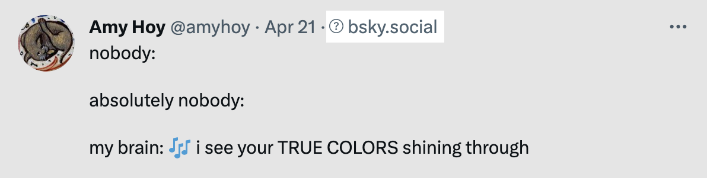
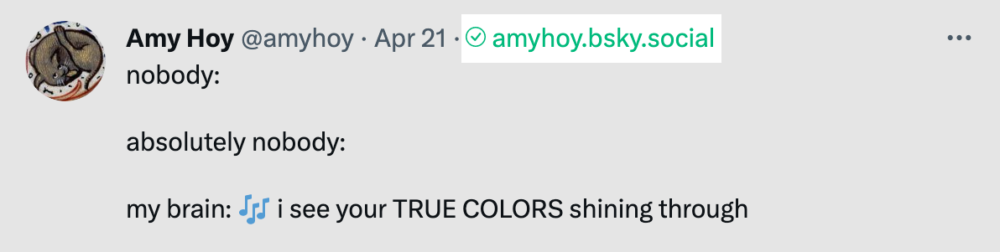
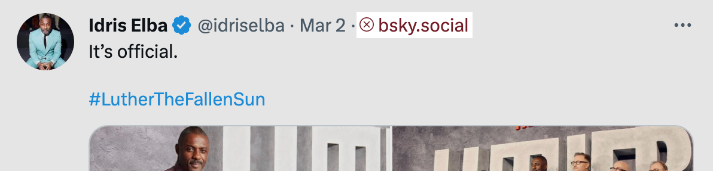
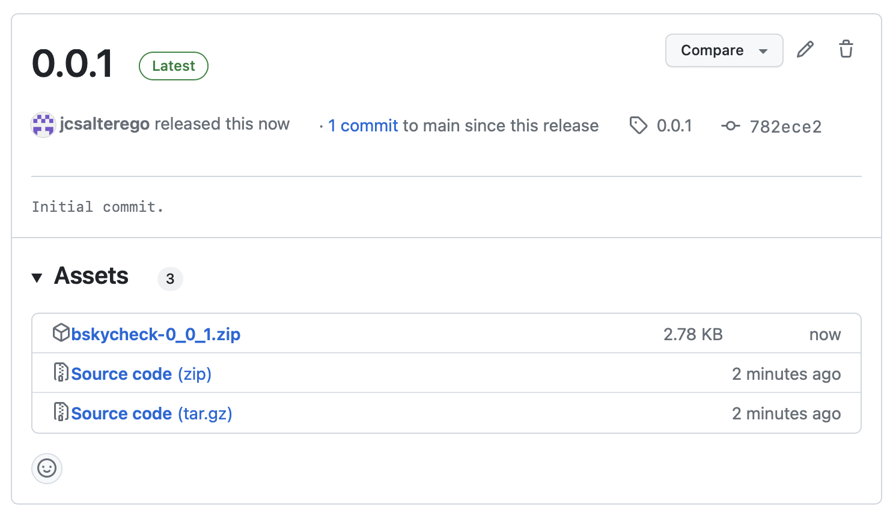
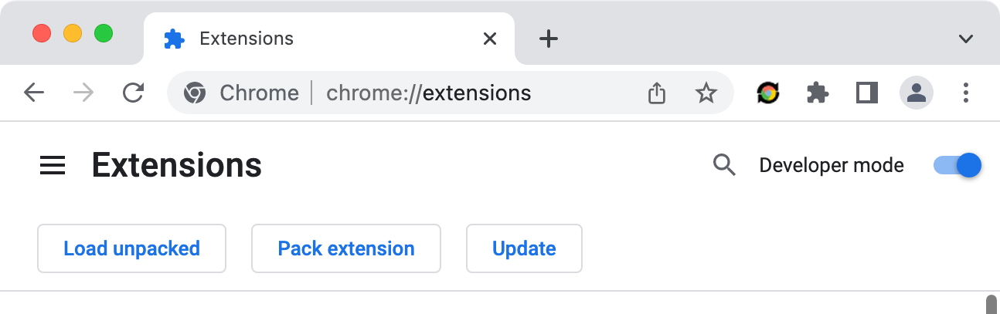

# bskycheck

A Chrome Extension to check if Twitter users have the same handle on `bsky.social`.

## Screenshots

# A New Link Appears

Click on the question mark to check the handle on `bsky.social`.

# Handle exists on bsky.social

If the handle does exist, the question mark turns into a clickable link to the profile.

# Handle does not exist on bsky.social

Otherwise, a red X will appear.

## Installation

1. Download the latest release `bskycheck-x_y_z.zip` from [Releases page](https://github.com/jcsalterego/bskycheck/releases/).

2. Navigate to `chrome://extensions`, enable Developer Mode. Click on
"Load unpacked" or drag the ZIP/folder right onto the page.

3. Navigate to [Twitter](https://www.twitter.com/home/).

## FAQ: I looked at the source code and it's not pretty

Next time @ me ([@jcsalterego.bsky.social](https://bsky.app/profile/jcsalterego.bsky.social))

## Changelog

### 0.0.3

* Remove underscores from Twitter username before checking.

### 0.0.2

* Use staging.bsky.app for now!

### 0.0.1

* First cut.

## LICENSE

[2-Clause BSD](LICENSE)
